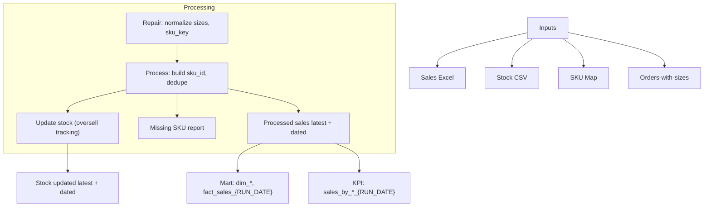

### Pipeline (Phase 1)

```mermaid
flowchart TD
  A["Inputs"]
  A --> A1["Sales Excel"]
  A --> A2["Stock CSV"]
  A --> A3["SKU Map"]
  A --> A4["Orders-with-sizes"]
  
  subgraph Processing
    P1["Repair: normalize sizes, sku_key"] --> P2["Process: build sku_id, dedupe"]
    P2 --> P3["Update stock (oversell tracking)"]
    P2 --> P4["Missing SKU report"]
    P2 --> P5["Processed sales latest + dated"]
  end
  
  P3 --> O1["Stock updated latest + dated"]
  P5 --> O2["Mart: dim_*, fact_sales_{RUN_DATE}"]
  P5 --> O3["KPI: sales_by_*_{RUN_DATE}"]
```

